# Massmore_OLED

**Massmore I2C OLED Display Modules — 0.91" / 0.96" / 1.3" / 1.5" / 1.54" / 2.42" (SKU-0102-1 … 12)**
Arduino IDE / PlatformIO driver library — **Version 1.0.0** by Massmore — *Designed and Manufactured by Massmore*

<table>
  <tr>
    <td align="center" width="50%">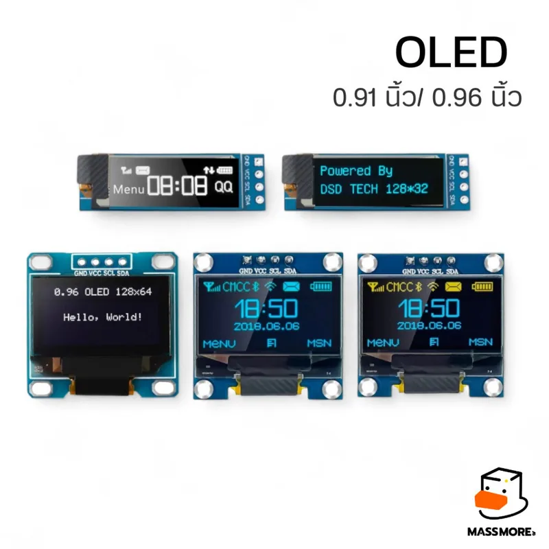<br><sub>0.91" / 0.96" — SSD1306 (128×32 / 128×64)</sub></td>
    <td align="center" width="50%">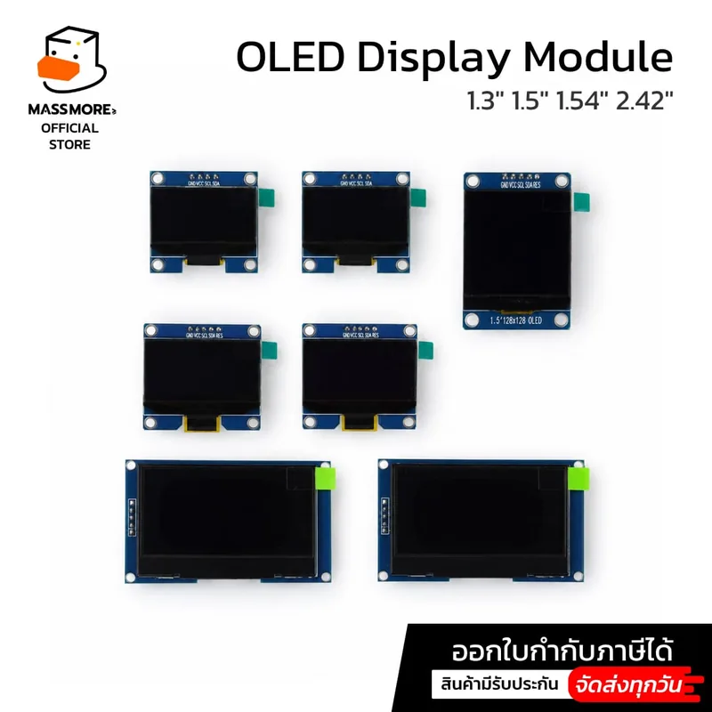<br><sub>1.3" / 1.5" / 1.54" / 2.42" — SH1106 / SH1107 / SSD1309</sub></td>
  </tr>
</table>

> **เริ่มต้นเร็วที่สุด:** ต่อ I2C (SDA/SCL/VCC/GND), เปิดตัวอย่าง `01_HelloWorld`, แก้บรรทัดเดียว `#define OLED_SKU OLED096_White_SSD1306`
> ให้ตรงรุ่นจอ แล้ว Upload — พิมพ์ได้ทั้งภาษาอังกฤษและ **ภาษาไทย** ทันที

---

## 1. Product Overview

ไลบรารีเดียวสำหรับจอ OLED I2C ทั้ง 12 รุ่นของ Massmore — ใช้ controller 4 ตระกูล (SSD1306, SSD1309, SH1106, SH1107)
ที่สื่อสารแบบเดียวกัน (I2C `0x3C/0x3D`, control byte `00h` = command / `40h` = data, RAM แบบ page 8 พิกเซลแนวตั้ง)
ต่างกันแค่ค่า init, column offset, ความสูงจอ และฟีเจอร์เสริม → ไลบรารีเก็บความต่างเป็น **ตาราง profile** ไม่ใช่ class แยกต่อชิป

<table>
  <tr>
    <td align="center" width="33%">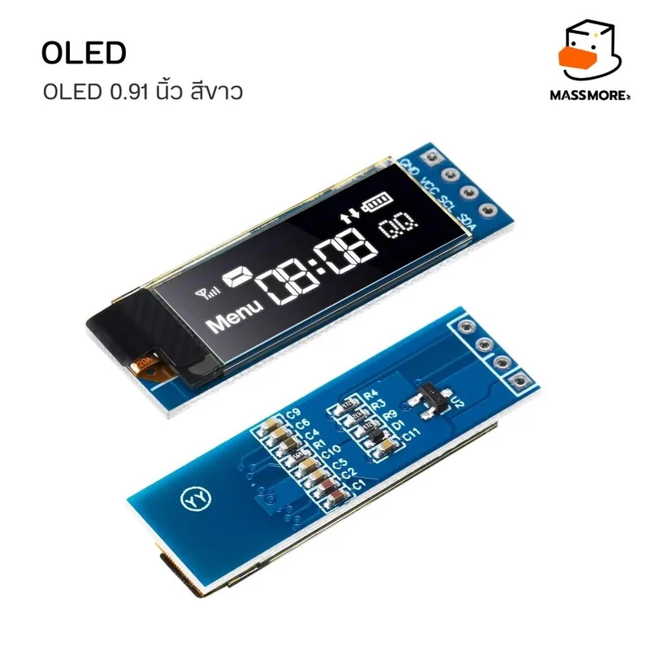<br><sub>0.91" ขาว — SKU-0102-1</sub></td>
    <td align="center" width="33%">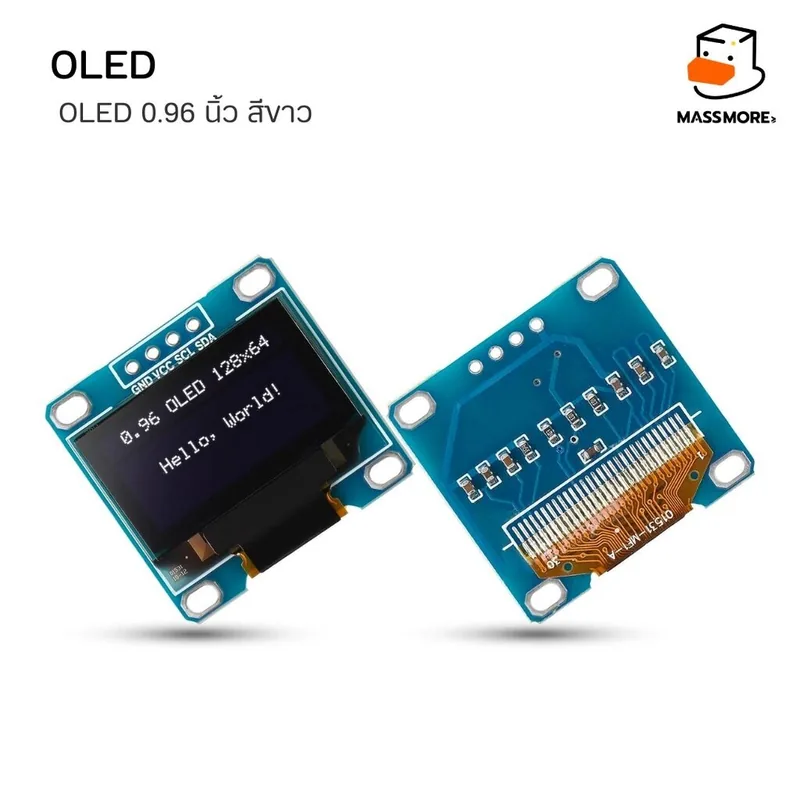<br><sub>0.96" ขาว — SKU-0102-3</sub></td>
    <td align="center" width="33%">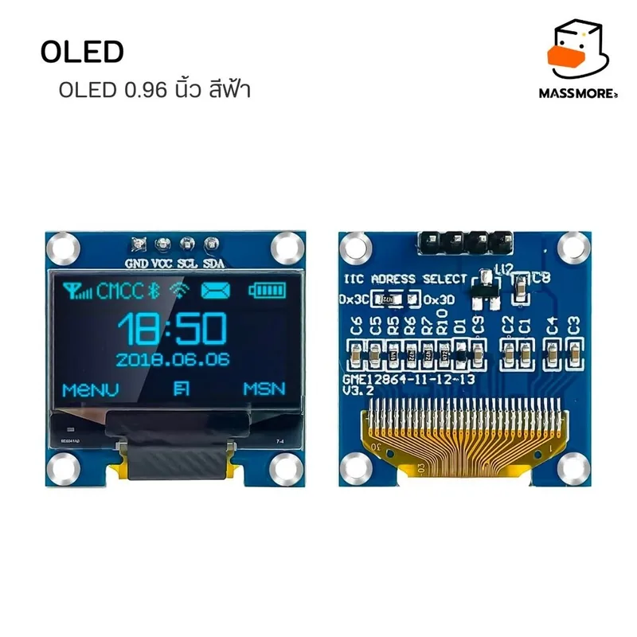<br><sub>0.96" ฟ้า — SKU-0102-4</sub></td>
  </tr>
  <tr>
    <td align="center" width="33%">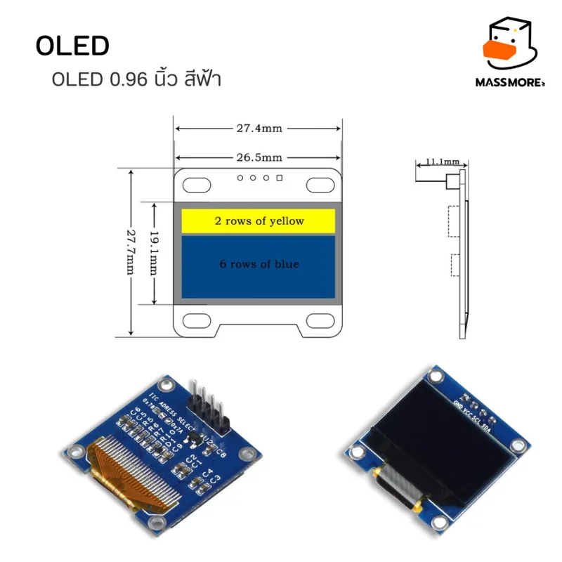<br><sub>0.96" ขนาด + โซนเหลือง 16 แถว (SKU-0102-5)</sub></td>
    <td align="center" width="33%">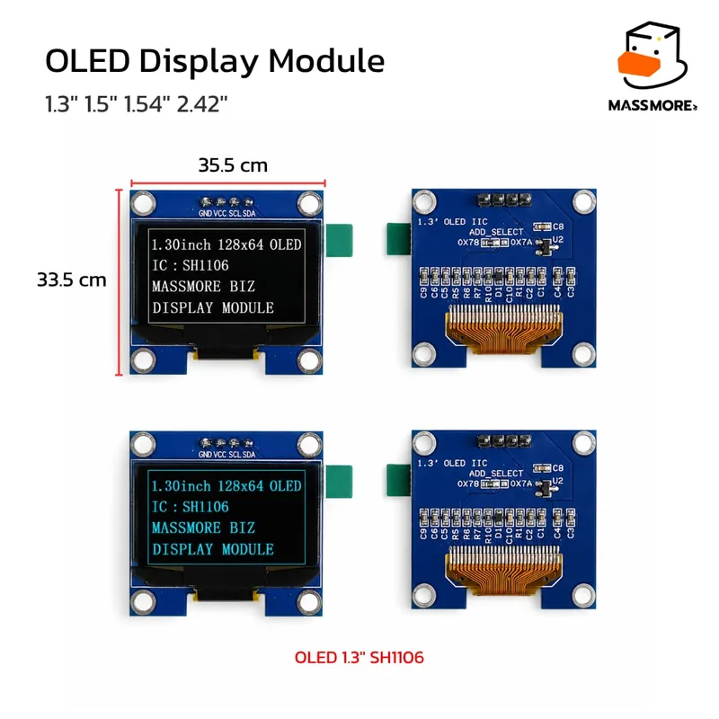<br><sub>1.3" SH1106 — SKU-0102-6/7</sub></td>
    <td align="center" width="33%">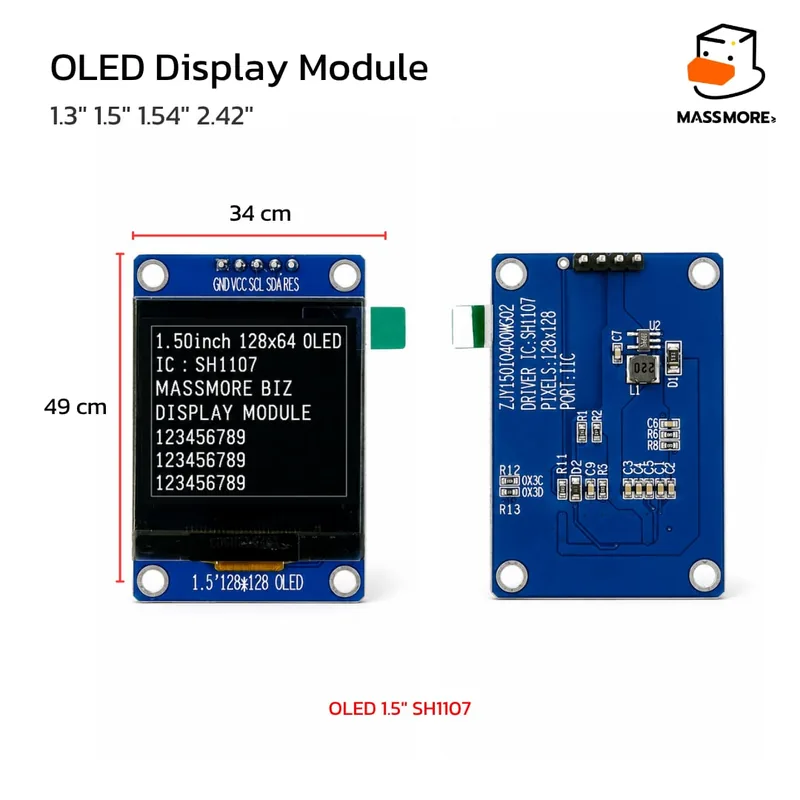<br><sub>1.5" SH1107 128×128 — SKU-0102-8</sub></td>
  </tr>
  <tr>
    <td align="center" width="33%">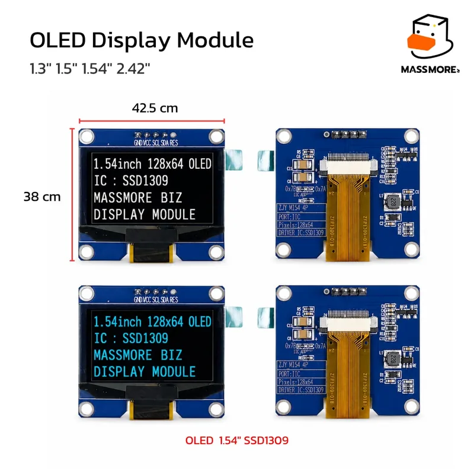<br><sub>1.54" SSD1309 — SKU-0102-9/10</sub></td>
    <td align="center" width="33%">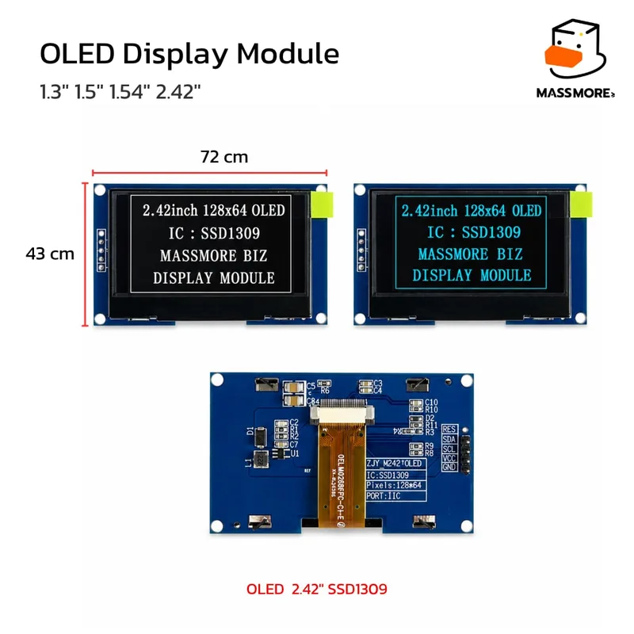<br><sub>2.42" SSD1309 — SKU-0102-11/12</sub></td>
    <td align="center" width="33%">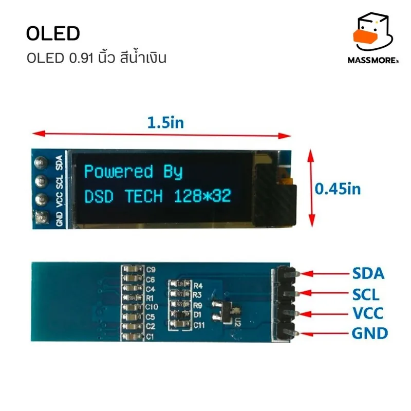<br><sub>0.91" ฟ้า + ขา — SKU-0102-2</sub></td>
  </tr>
</table>

### SKU table

> ชื่อรุ่น = `OLED<ขนาด>_<สี>_<ชิป>` — ขนาด = นิ้ว × 100 (`096` = 0.96") เพราะชื่อในภาษา C++ ใส่จุดไม่ได้
> ชื่อแบบเดิม `MASSMORE_OLED_SKU_0102_N` ยังใช้ได้ (ค่าเดียวกัน)
>
> สี (White / Blue / Blue-Yellow) เป็นคุณสมบัติของกระจกเท่านั้น — โค้ดเหมือนกัน (ยกเว้น helper โซนสีเหลืองของ Blue-Yellow)

| SKU | Size | Colour | Controller | Resolution | Pins | RES | `OLED_SKU` (ชื่ออ่านง่าย) |
|---|---|---|---|---|---|---|---|
| SKU-0102-1 | 0.91" | White | SSD1306 | 128×32 | 4 | — | `OLED091_White_SSD1306` |
| SKU-0102-2 | 0.91" | Blue | SSD1306 | 128×32 | 4 | — | `OLED091_Blue_SSD1306` |
| SKU-0102-3 | 0.96" | White | SSD1306 | 128×64 | 4 | — | `OLED096_White_SSD1306` |
| SKU-0102-4 | 0.96" | Blue | SSD1306 | 128×64 | 4 | — | `OLED096_Blue_SSD1306` |
| SKU-0102-5 | 0.96" | Blue-Yellow | SSD1306 | 128×64 | 4 | — | `OLED096_BlueYellow_SSD1306` |
| SKU-0102-6 | 1.3" | White | SH1106 | 128×64 (RAM 132) | 4 | — | `OLED130_White_SH1106` |
| SKU-0102-7 | 1.3" | Blue | SH1106 | 128×64 (RAM 132) | 4 | — | `OLED130_Blue_SH1106` |
| SKU-0102-8 | 1.5" | White | SH1107 | 128×128 | 5 | **Yes** | `OLED150_White_SH1107` |
| SKU-0102-9 | 1.54" | White | SSD1309 | 128×64 | 4 | — | `OLED154_White_SSD1309` |
| SKU-0102-10 | 1.54" | Blue | SSD1309 | 128×64 | 4 | — | `OLED154_Blue_SSD1309` |
| SKU-0102-11 | 2.42" | White | SSD1309 | 128×64 | 5 | **Yes** | `OLED242_White_SSD1309` |
| SKU-0102-12 | 2.42" | Blue | SSD1309 | 128×64 | 5 | **Yes** | `OLED242_Blue_SSD1309` |

- I2C address default `0x3C` (บน silkscreen เขียน `0x78` = รูปแบบ 8 บิต) · `0x3D` บนโมดูลที่มี resistor SA0
- ไฟเลี้ยง 3.3–5 V · อุณหภูมิใช้งาน −40 … 85 °C
- ใช้กับจอยี่ห้ออื่นได้ด้วยการเลือกตามชิป: `MASSMORE_OLED_SSD1306_128X32`, `…_SSD1306_128X64`, `…_SH1106_128X64`,
  `…_SH1107_128X128`, `…_SSD1309_128X64`, `…_SSD1309_128X64_242` หรือ `MASSMORE_OLED_AUTO`

### Library highlights

- **Include ไฟล์เดียว** `#include <Massmore_OLED.h>` — driver + กราฟิก + ภาษาไทย + UI widgets
- **Zero dependency** (มีแค่ `Wire`) · ไม่มี `malloc` / `String` · ไม่ hardcode ขา · sketch เป็นเจ้าของ I2C bus
- **API เข้ากันได้กับ Adafruit-GFX** (`drawLine`, `fillRect`, `drawBitmap`, `setTextSize`, `getTextBounds` …) และใช้ฟอนต์ **GFXfont** ได้ทันที
- **ภาษาไทย** UTF-8 พร้อมจัดตำแหน่งสระ/วรรณยุกต์ (วรรณยุกต์ลอยต่ำ, ป ฝ ฟ ฬ, ญ ฐ ตัดเชิง, ฎ ฏ, สระอำ) ฟอนต์ **Sarabun 12 / 16 / 20 / 24 / 32 px**
- ส่งจอเฉพาะ **page ที่เปลี่ยน** + `displayStep()` แบบ non-blocking ทีละ page
- HW scroll (SSD1306/SSD1309), content scroll (SSD1309), software scroll ทุกชิป
- **Controller Identity Verification** + Factory Test sketch + firmware สำเร็จรูปสำหรับ Massmore Web Serial Monitor

---

## 2. Pinout

<table>
  <tr>
    <td align="center" width="50%"><br><sub>4 ขา: GND · VCC · SCL · SDA</sub></td>
    <td align="center" width="50%"><br><sub>5 ขา (1.5" / 2.42"): GND · VCC · SCL · SDA · RES</sub></td>
  </tr>
</table>

| Module | Pins (ซ้าย → ขวา) |
|---|---|
| 0.91" / 0.96" (SSD1306), 1.3" (SH1106), 1.54" (SSD1309) | **4 ขา** `GND` `VCC` `SCL` `SDA` |
| 1.5" (SH1107), 2.42" (SSD1309) | **5 ขา** `GND` `VCC` `SCL` `SDA` `RES` — **ต้องต่อ RES เข้า GPIO** (โมดูลแปลงจาก SPI เป็น I2C) |

| Signal | ESP32 Classic | ESP32-S3 (MOMO) | Arduino Nano |
|---|---|---|---|
| `SDA` | GPIO 21 | GPIO 14 | A4 |
| `SCL` | GPIO 22 | GPIO 15 | A5 |
| `RES` (จอ 5 ขา) | GPIO 17 (factory jig) | GPIO 18 | D4 (ตัวอย่าง) |
| `VCC` / `GND` | 3V3 / GND | 3V3 / GND | 5V หรือ 3V3 / GND |

---

## 3. MCU Compatibility & Limitation Matrix

| MCU Platform | Tested Core / Toolchain | 128×32 / 128×64 | 128×128 (SH1107) | Thai fonts | Notes |
|---|---|---|---|---|---|
| **ESP32 (Classic)** | Arduino-ESP32 v3.3.x (pioarduino 55.03.311) | ✓ | ✓ | 12–32 px ทั้งหมด | Factory Test MCU · I2C ขาใดก็ได้ |
| **ESP32-S3** | Arduino-ESP32 v3.3.x | ✓ | ✓ | 12–32 px ทั้งหมด | MOMO board · ปิด USB CDC (`-DARDUINO_USB_CDC_ON_BOOT=0`) |
| **AVR ATmega328P (Nano)** | Arduino AVR Core | ✓ | ✗ (v1.0) | 16 px (เพิ่มได้) | buffer 1 KB จาก RAM 2 KB · I2C ตายตัว A4/A5 |

ขนาดจริงที่วัดได้ (`01_HelloWorld` รวมฟอนต์ Sarabun16): **Nano** RAM 1,658 B / Flash 18.7 KB · **ESP32** Flash 319 KB (รวม core)
SH1107 128×128 บน Nano: `begin()` คืน `MASSMORE_OLED_ERR_NO_BUFFER` (ต้องใช้ buffer 2 KB)

---

## 4. Installation

### Arduino IDE

1. `Sketch ▸ Include Library ▸ Add .ZIP Library…` แล้วเลือก `ArduinoIDE/Massmore_OLED.zip`
2. `File ▸ Examples ▸ Massmore_OLED ▸ 01_HelloWorld`
3. ESP32: ติดตั้ง board package **esp32 by Espressif v3.x** ขึ้นไป

### PlatformIO (VS Code)

1. เปิดโฟลเดอร์ `PlatformIO/` ใน VS Code — ไลบรารีถูก vendor ไว้ที่ `lib/Massmore_OLED` แล้ว ไม่ต้องติดตั้งเพิ่ม
2. เลือก env: `esp32dev` (default), `esp32-s3-devkitc-1` หรือ `nano` แล้วกด Build / Upload
3. `src/main.cpp` = ตัวอย่าง `01_HelloWorld` — ต้องการตัวอย่างอื่น copy `.ino` มาทับแล้วเติม `#include <Arduino.h>` บรรทัดแรก

Upload speed หลัก `512000` (Mac) · ถ้าไม่นิ่งเปลี่ยนเป็น `460800` หรือเร็วกว่าที่ `921600` ใน `platformio.ini`

---

## 5. Quick Start

```cpp
#include <Wire.h>
#include <Massmore_OLED.h>

Massmore_OLED oled(OLED096_White_SSD1306);      // 0.96" สีขาว · ไม่แน่ใจรุ่นใช้ MASSMORE_OLED_AUTO

void setup() {
  Wire.begin(21, 22);                           // ESP32: sketch กำหนดขาเอง (Nano: Wire.begin())
  Wire.setClock(400000);
  if (oled.begin(Wire, 0x3C) != MASSMORE_OLED_OK) {   // จอ 5 ขา: oled.begin(Wire, 0x3C, 17)
    while (true) delay(10);
  }
  oled.setCursor(0, 0);
  oled.println("Hello, Massmore!");             // ฟอนต์ 5x7 ในตัว
  oled.setFont(&Sarabun16);                     // ฟอนต์ไทย
  oled.setCursor(0, 46);                        // y = baseline
  oled.print("สวัสดีครับ");
  oled.display();                               // ส่ง buffer ขึ้นจอ
}

void loop() {}
```

> ไลบรารี **ไม่เรียก** `Wire.begin()` — sketch เป็นเจ้าของ bus (ใช้ bus ร่วมกับเซนเซอร์อื่นได้, ใช้ `Wire1` ได้)

---

## 6. API Reference

### Start-up

| Method | Description |
|---|---|
| `Massmore_OLED oled(model)` | `OLED096_White_SSD1306` ฯลฯ, `MASSMORE_OLED_SKU_0102_1…12`, ตามชิป หรือ `MASSMORE_OLED_AUTO` |
| `begin(wire, addr = 0x3C, rstPin = -1)` | reset → ACK → (AUTO probe) → init → ล้างจอ → เปิดจอ · คืน `Massmore_OLED_Error` |
| `end()` / `reset()` / `setModel(model)` | sleep และเลิกใช้ / pulse RES / เปลี่ยนรุ่นก่อน `begin()` |
| `setI2CClock(hz)` / `isConnected()` | เปลี่ยน clock / ตรวจ ACK |
| `getModel()`, `getModelName()`, `getController()`, `getControllerName()` | รุ่นและชิป |
| `getPanelSize()`, `getPanelColour()`, `width()`, `height()`, `getPages()`, `hasFeature(flag)` | ข้อมูลจอ |

### Buffer

| Method | Description |
|---|---|
| `display()` | ส่งเฉพาะ page ที่เปลี่ยน (dirty) |
| `displayAll()` | ส่งทุก page |
| `displayStep()` / `isBusy()` / `getDirtyMask()` | ส่งทีละ 1 page ต่อการเรียก (cooperative non-blocking) |
| `clear()`, `fill(color)`, `getBuffer()`, `setAutoDisplay(bool)` | |

### Drawing (Adafruit-GFX compatible) — สี `BLACK` / `WHITE` / `INVERSE`

`drawPixel`, `getPixel`, `drawLine`, `drawFastHLine`, `drawFastVLine`, `drawRect`, `fillRect`, `drawRoundRect`, `fillRoundRect`,
`drawCircle`, `fillCircle`, `drawEllipse`, `fillEllipse`, `drawTriangle`, `fillTriangle`, `drawArc(x, y, r, startDeg, endDeg, color, thickness)`,
`drawBitmap` (PROGMEM / RAM, มี/ไม่มีสีพื้น), `drawXBitmap` (XBM), `scrollBuffer(dx, dy)`, `setRotation(0–3)`

### Text

| Method | Description |
|---|---|
| `print / println / printf` | UTF-8 (`printf` บน AVR ไม่รองรับ `%f`) |
| `setCursor`, `setTextSize(s)` / `(sx, sy)`, `setTextColor(fg[, bg])`, `setTextWrap`, `setUTF8` | |
| `setFont()` / `setFont(&GFXfont)` / `setFont(&Sarabun16)` | 5x7 ในตัว / Adafruit GFXfont / ฟอนต์ไทย |
| `drawText(x, y, str, ALIGN_LEFT / CENTER / RIGHT)` | รับ `F("…")` ได้ |
| `getTextBounds`, `textWidth`, `fontHeight`, `fontAscent`, `fontXHeight` | วัดข้อความ |
| `setThaiFont`, `drawThai`, `thaiTextWidth` | alias สำหรับภาษาไทย |

Cursor: ฟอนต์ 5x7 → `y` = ขอบบน · GFXfont / ฟอนต์ไทย → `y` = baseline (เหมือน Adafruit-GFX)

### Display control

| Method | Description |
|---|---|
| `setContrast(0–255)`, `setBrightness(0–100 %)` | |
| `invert(bool)`, `allPixelsOn(bool)` | `A7h` / `A5h` (ฮาร์ดแวร์) |
| `flipHorizontal(bool)`, `flipVertical(bool)` | SEG / COM remap (ฮาร์ดแวร์) |
| `sleep()`, `wake()` | ปิดจอ + charge pump (SSD1306) / DC-DC (SH1106) |
| `setDisplayOffset(rows)`, `setStartLine(line)` | `D3h` / `40h` หรือ `DCh` (SH1107) |

### Scroll

| Method | SSD1306 | SSD1309 | SH1106 / SH1107 |
|---|---|---|---|
| `scrollRight/Left(startPage, endPage, speed 0–7)` | ✓ | ✓ | `ERR_NOT_SUPPORTED` |
| `scrollDiagRight/Left(…, vOffset)` | ✓ | ✓ | `ERR_NOT_SUPPORTED` |
| `scrollStop()` (เขียน buffer กลับให้) | ✓ | ✓ | `ERR_NOT_SUPPORTED` |
| `scrollContent(dir)` | — | ✓ (`2Ch/2Dh`) | `ERR_NOT_SUPPORTED` |
| `setVerticalScrollArea(top, rows)` | ✓ | ✓ | `ERR_NOT_SUPPORTED` |
| `scrollBuffer(dx, dy)` (software) | ✓ | ✓ | ✓ |

### Low level / Identity / Errors

| Method | Description |
|---|---|
| `command(c[, a])`, `commandList(buf, len)`, `data(buf, len)`, `readStatus()` | ส่งคำสั่ง / ข้อมูล / อ่าน status byte (-1 = อ่านไม่ได้) |
| `detectController()`, `readChipID()`, `verifyController()`, `getIdentityReport(Serial)` | ดูหัวข้อ 11 |
| `lastError()`, `errorString(code)` | `OK`, `ERR_NO_ACK`, `ERR_BUS`, `ERR_NO_BUFFER`, `ERR_BAD_MODEL`, `ERR_NOT_SUPPORTED`, `ERR_ID_MISMATCH`, `ERR_NOT_STARTED` |
| `MASSMORE_OLED_BY_YELLOW_H` (= 16), `isYellowZone(y)` | จอ Blue-Yellow: แถว 0–15 เป็นสีเหลือง |

### UI widgets (`Massmore_OLED_UI ui(oled);`)

`progressBar`, `gauge`, `battery`, `signalBars`, `listMenu` (รองรับเมนูไทย), `header` (แถบหัว 16 px = โซนเหลือง), `toggle`, `spinner`
และ `Massmore_OLED_Chart chart(array, n)` — กราฟเส้นแบบ ring buffer (sketch จอง array เอง)

---

## 7. Thai Font (Sarabun)

```cpp
oled.setFont(&Sarabun20);
oled.setCursor(0, oled.fontAscent());
oled.print("ปู่ ญี่ปุ่น น้ำ ฟ้า");
oled.drawText(oled.width() / 2, 60, F("กึ่งกลาง"), ALIGN_CENTER);
```

| ฟอนต์ | ขนาด em | ระยะบรรทัด | Flash โดยประมาณ |
|---|---|---|---|
| `Sarabun12` | 12 px | 23 px | 2.2 KB |
| `Sarabun16` | 16 px | 30 px | 3.0 KB |
| `Sarabun20` | 20 px | 35 px | 3.9 KB |
| `Sarabun24` | 24 px | 43 px | 4.9 KB |
| `Sarabun32` | 32 px | 55 px | 7.8 KB |

- **ESP32:** ใช้ได้ทุกขนาด — ฟอนต์ที่ไม่ได้เรียกใช้ linker ตัดทิ้งเอง
- **Nano:** `Sarabun16` อย่างเดียวเป็นค่าเริ่มต้น · เพิ่มด้วย `#define MASSMORE_THAI_FONT_12` (หรือ `_20/_24/_32`, `MASSMORE_THAI_FONT_ALL`) **ก่อน** `#include <Massmore_OLED.h>`
- เก็บข้อความไทยใน flash ด้วย `F("…")` บน Nano (อักษรไทย 1 ตัว = 3 byte)
- ขยายแบบบล็อกด้วย `setTextSize(2)` ได้ทุกฟอนต์
- **การตัดบรรทัด:** ภาษาไทยไม่มีช่องว่างระหว่างคำ → ไลบรารีตัดเฉพาะที่ช่องว่างหรือ **ZWSP** (`"\u200B"`) ให้แทรก ZWSP ตรงที่ตัดได้
  เช่น `"ไลบรารี\u200Bจอ\u200BOLED"` (ZWSP ไม่แสดงผล)
- ตัวอักษรที่ไม่มีในฟอนต์ (เช่น `°`, emoji) จะถูกข้าม
- **License:** bitmap สร้างจาก Google Fonts **Sarabun** (Cadson Demak) — **SIL Open Font License 1.1** ดู `src/fonts/OFL.txt`
  (ไม่ใช้ TH Sarabun New ซึ่งเป็น GPL 2.0 + font exception)

---

## 8. Examples

| # | Example | Level | Covers |
|---|---|---|---|
| 01 | `01_HelloWorld` | Basic | begin, clear, print ไทย/อังกฤษ, display, error handling |
| 02 | `02_Graphics_Primitives` | Basic | ทุกฟังก์ชัน draw* + สี INVERSE |
| 03 | `03_Text_Fonts` | Basic | ฟอนต์ 5x7, ขนาด, wrap, จัดตำแหน่ง, ตัวเลข/float/printf, `getTextBounds`, GFXfont |
| 04 | `04_Thai_Sarabun` | Intermediate | ทุกขนาด, ไทยปนอังกฤษ, สระ/วรรณยุกต์ซ้อน, จัดกึ่งกลาง, ZWSP |
| 05 | `05_Bitmap_Animation` | Intermediate | PROGMEM bitmap, XBM, sprite, FPS counter |
| 06 | `06_Display_Control_Scroll` | Intermediate | contrast, invert, rotation, flip, sleep/wake, HW scroll vs software scroll |
| 07 | `07_UI_Widgets` | Advance | progress, gauge, battery, signal, toggle, spinner, เมนูไทย, กราฟ, layout Blue-Yellow |
| 08 | `08_NonBlocking_Dashboard` | Advance | `millis()` scheduler, `displayStep()`, dirty pages, FreeRTOS task, 2 จอ |
| 09 | `09_AutoDetect_Identity` | Advance | I2C scan, `MASSMORE_OLED_AUTO`, status/ID, identity report |
| 10 | `10_Factory_Test` | Factory | QA/QC ก่อนส่งของ — ดูหัวข้อ 9 |

ทุกตัวอย่าง build ผ่านโดยไม่มี warning (`-Wall -Wextra`) บน `esp32dev`, `esp32-s3-devkitc-1` และ `nano`

---

## 9. Factory Test & Web Serial Monitor

`10_Factory_Test` + firmware สำเร็จรูปใน [`firmware/`](firmware/) (ESP32 Classic, SDA 21 / SCL 22, RES 17)

**Firmware ตัวเดียวใช้ได้ทุกขนาด**

1. Flash `firmware/bin/Massmore_OLED_FactoryTest_ESP32.bin` ที่ `0x0` (esptool `--baud 460800` / ESP Web Tools — ดู `firmware/README.md`)
2. เสียบจอ → บอร์ด **ตรวจชิปให้ก่อน** แล้วรายงาน `#DETECT <ชิป>` (แสดงบนจอด้วย — ยกเว้นตระกูล SSD1306/SSD1315 ที่จอว่างไว้ เพราะ 0.91" กับ 0.96" ใช้ชิปเดียวกัน)
3. พิมพ์ขนาดจอใน Serial Monitor: `0.91` `0.96` `1.3` `1.5` `1.54` `2.42` (+`B` ฟ้า / `Y` ฟ้า-เหลือง) หรือ `SKU 0102-N`
4. ทดสอบทางไฟฟ้า 9 ข้อ แล้วพนักงานดูภาพทดสอบ กด `P` / `F` หรือปุ่ม BOOT
5. เสียบจอถัดไปแล้วกด Enter — ขนาดที่พิมพ์ไม่ตรงชิปจะ FAIL (`EXPECT_SH1106_GOT_SSD1315`)

```text
#DETECT SSD1315 0x3C
#PROMPT SIZE
#MASSMORE_FACTORY_TEST v1.0
#PRODUCT Massmore_OLED
#SKU SKU-0102-1
#MCU ESP32
#RESULT BUS_SCAN PASS 0x3C
#RESULT RESET_PIN SKIP 4PIN_MODULE
#RESULT INIT_SEQ PASS SKU-0102-1
#CHIP SSD1306
#RESULT CHIP_STATUS PASS 0x02
#RESULT CONTROLLER_ID PASS SSD1315_VERIFIED
#RESULT DISPLAY_ONOFF PASS D6_TOGGLES
#RESULT FRAME_WRITE PASS 13.9ms
#RESULT FRAME_RATE PASS 71fps
#RESULT I2C_400K PASS 50/50
#RESULT VISUAL PASS OPERATOR_OK
#VERDICT PASS
[PASS] OLED QA PASSED - READY TO SHIP - SSD1315
#DRIVER SSD1315
PASS - SSD1315
```

(ผลจริงจอ 0.91" 2026-10-05) · จุดตาย (dead pixel) ตรวจทางไฟฟ้าไม่ได้ ตรวจได้ในขั้น VISUAL เท่านั้น

---

## 10. Expected Performance (400 kHz, theoretical)

| Panel | Bytes / frame | Full refresh | ~FPS |
|---|---|---|---|
| 128×32 | 512 | ~12 ms | ~80 |
| 128×64 | 1024 | ~24 ms | ~40 |
| 128×128 | 2048 | ~48 ms | ~20 |

`display()` ส่งเฉพาะ page ที่เปลี่ยน — อัปเดตตัวเลขบรรทัดเดียวใช้เวลาแค่ ~3 ms
ESP32 ตั้ง `Wire.setClock(800000)` ได้ แต่เกิน spec 400 kHz ของชิป — ทดสอบกับจอจริงก่อนใช้งาน

---

## 11. Controller Identity Verification

ชิปเหล่านี้ **ไม่มี** serial number / OTP ID — ไลบรารีจึงตรวจว่าชิป "ทำงานตรงตาม datasheet ของ controller"
และตรงกับ SKU ที่เลือก (จับชิปทดแทน เช่น SSD1315 / CH1116 ที่ขายเป็น SSD1306 หรือ SSD1306 ที่ขายเป็น SSD1309)
**ไม่ใช่** การพิสูจน์ของแท้แบบ cryptographic — ผลแสดงเป็น *"Controller Identity: VERIFIED by Massmore"*

| Check | Source | SSD1306 | SSD1309 | SH1106 | SH1107 |
|---|---|---|---|---|---|
| ACK ที่ 0x3C/0x3D | ทุก datasheet | ✓ | ✓ | ✓ | ✓ |
| Status / ID byte | SH1106, SH1107, SSD1309 Table 9-6 | มักอ่านไม่ได้ (§10.1.21) | bench-verify | 3 บิตล่าง `000` | **6 บิตล่าง `000111` (07h)** |
| ON/OFF loop-back (D6 ตาม AEh/AFh) | ทั้ง 4 ชิป | ถ้าอ่านได้ | ✓ | ✓ | ✓ |
| Command lock `FDh 16h` | SSD1309 §10.22 | ล็อกไม่ได้ (SSD1315 ล็อกได้) | **ล็อกได้** | ล็อกไม่ได้ | ล็อกไม่ได้ |

ผลลัพธ์: `VERIFIED` · `CONSISTENT` (ไม่ขัดแย้ง แต่อ่าน status ไม่ได้) · `MISMATCH` · `UNKNOWN`

`MASSMORE_OLED_AUTO` ใช้การตรวจเดียวกัน (ทดสอบ lock ก่อนเสมอ): lock ได้ → **SSD1309/SSD1315** (ใช้ profile SSD1306 128x64) · ID 07h → SH1107 · 3 บิตล่าง `000` → SH1106 · อื่น ๆ → SSD1306

> **วัดจริง:** SSD1309 และ SSD1315 ตอบ command lock เหมือนกัน (D7 = 1 ขณะล็อกทั้งคู่, บิตล่างของ status ไม่คงที่) จึงแยกกันทางไฟฟ้าไม่ได้ —
> `verifyController()` ใช้ SKU ที่เลือกตัดสิน: SKU ตระกูล SSD1306 + ล็อกได้ = **SSD1315**, SKU 1.54"/2.42" + ล็อกได้ = **SSD1309**

> **SSD1315:** จอ 0.91"/0.96" ล็อตใหม่ใช้ SSD1315 ซึ่งสั่งงานเหมือน SSD1306 แต่มีคำสั่ง lock — ไลบรารียอมรับเป็น SKU ตระกูล SSD1306 (`SSD1315_VERIFIED`)
**SSD1306 128×32 กับ 128×64 แยกทางไฟฟ้าไม่ได้** → AUTO ถือเป็น 128×64 — เลือกตาม SKU จะแม่นที่สุด

> **Bench verification (Phase 8):** ค่าที่ระบุ "bench-verify" ต้องวัดกับจอจริงทั้ง 12 SKU ก่อน release แล้วเติมตารางผลวัดที่นี่

| SKU | Controller | Status byte (display ON) | Identity | Frame (400 kHz) | Date |
|---|---|---|---|---|---|
| SKU-0102-6 | SH1106 | `0x28` | VERIFIED | 28.4 ms · 35 fps | 2026-10-05 |
| SKU-0102-1 | SSD1306 SKU → ชิปจริง **SSD1315** (มี command lock, D7 = 1 ขณะล็อก → `0x82`) | `0x02` | VERIFIED (SSD1315) | 14.3 ms · 69 fps | 2026-10-05 |
| SKU-0102-2 | SSD1306 SKU → ชิปจริง **SSD1315** (เหมือน SKU-0102-1) · COM `DA 02` ยืนยันด้วยตา | `0x02` | VERIFIED (SSD1315) | 13.9 ms · 71 fps | 2026-10-05 |
| SKU-0102-4 | SSD1306 SKU → ชิปจริง **SSD1315** · status บิตล่างไม่คงที่ (`0x07` / `0x02` ในจอตัวเดียวกัน — `0x07` ซ้ำกับ ID ของ SH1107 → ไลบรารีทดสอบ lock ก่อนเสมอ) | `0x02` / `0x07` | VERIFIED (SSD1315) | 27.8 ms · 35 fps | 2026-10-05 |
| SKU-0102-5 | SSD1306 SKU (Blue-Yellow) → ชิปจริง **SSD1315** · โซนเหลือง 16 px ตรงตาม `MASSMORE_OLED_BY_YELLOW_H` (ยืนยันด้วยตา) | `0x02` | VERIFIED (SSD1315) | 27.8 ms · 35 fps | 2026-10-05 |
| SKU-0102-11 | SSD1309 (2.42", ทดสอบแบบ**ไม่ต่อ RES** — โมดูลมี reset ในตัว) · D7 = 1 ขณะล็อก **เหมือน SSD1315** | `0x01` | VERIFIED | 28.0 ms · 35 fps | 2026-10-05 |

> TODO: [MASSMORE_INPUT_REQUIRED: measured status byte for the remaining SKUs]

---

## 12. Troubleshooting

| อาการ | สาเหตุ / วิธีแก้ |
|---|---|
| `begin()` คืน `ERR_NO_ACK` | ตรวจสาย SDA/SCL สลับกันหรือไม่, ไฟเลี้ยง, address (`0x3C`/`0x3D`) — รัน `09_AutoDetect_Identity` เพื่อสแกน |
| จอ 2.42" / 1.5" มืด ไม่ตอบ | ยังไม่ได้ต่อ **RES** — ต่อเข้า GPIO แล้วใส่เลขขาใน `begin(Wire, 0x3C, rstPin)` |
| มีคอลัมน์ขยะ 2 px ที่ขอบ / ภาพเลื่อน 2 px | เลือกรุ่นผิด: จอ 1.3" ต้องเป็น `OLED130_White_SH1106` / `OLED130_Blue_SH1106` |
| จอ 0.91" แสดงครึ่งเดียว / ภาพยืด | เลือกรุ่นผิด: 0.91" = 128×32 (`OLED091_White_SSD1306` / `OLED091_Blue_SSD1306`) |
| จอ 1.5" ภาพเลื่อนแนวตั้ง | ปรับ `setDisplayOffset()` (ค่าผู้ผลิต `0x60`, บางล็อตใช้ `0x00`) |
| SH1107 บน Nano คืน `ERR_NO_BUFFER` | RAM ไม่พอ (ต้องใช้ 2 KB) — ใช้ ESP32 |
| สระ/วรรณยุกต์ไทยหายบางตัว | ใช้ `setFont(&SarabunNN)` ไม่ใช่ฟอนต์ 5x7 · เว้นระยะบรรทัดให้พอ (`fontHeight()`) |
| ข้อความไทยไม่ขึ้นบรรทัดใหม่ | แทรกช่องว่างหรือ ZWSP `"\u200B"` ตรงที่ตัดได้ |
| Nano ค้าง / รีเซ็ตเอง | RAM เต็ม — ใช้ `F("…")` กับข้อความ, ลดขนาด array |
| Upload ไม่นิ่ง | ลด `upload_speed` เป็น `460800` หรือ `115200` |

---

## 13. Where to Buy

- massmore.shop — 0.91" / 0.96" (SSD1306): <https://www.massmore.shop/products/808aa292-9080-4282-b7fd-24884b2a988c>
- massmore.shop — 1.3" / 1.5" / 1.54" / 2.42" (SH1106 / SH1107 / SSD1309): <https://www.massmore.shop/products/29664f20-b61c-48fa-a6c1-556b5ab50fba>
- Shopee: TODO: [MASSMORE_INPUT_REQUIRED: Shopee URL]
- Lazada: TODO: [MASSMORE_INPUT_REQUIRED: Lazada URL]

## 14. License

- Library code: **MIT** © 2026 Massmore Biz Co., Ltd. — ดู `ArduinoIDE/Massmore_OLED/LICENSE`
- Thai font bitmaps (`src/fonts/Sarabun*.h`): **SIL Open Font License 1.1** — Copyright 2018 The Sarabun Project Authors — ดู `src/fonts/OFL.txt`
- ไม่มีโค้ดของ Adafruit ถูกคัดลอก — layout ของ `GFXfont` / `GFXglyph` เหมือนกันเพื่อความเข้ากันได้เท่านั้น

*Designed and Manufactured by Massmore — <https://www.massmore.shop>*
